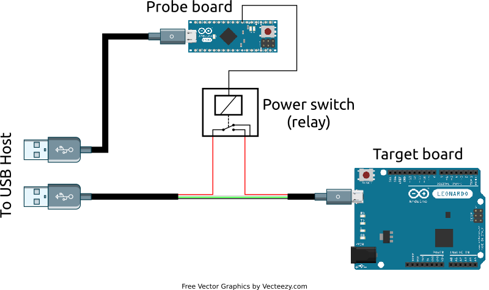
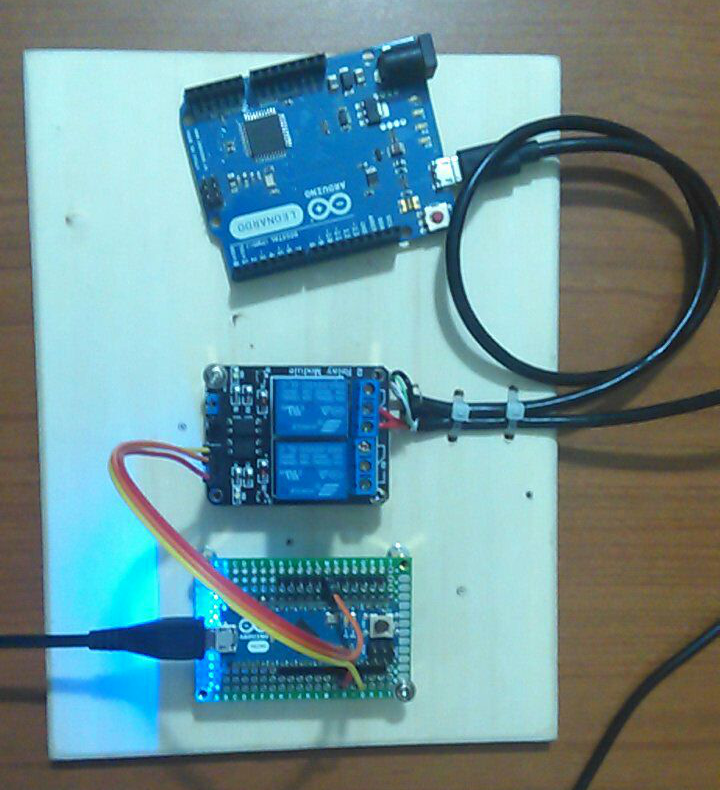

# Testsuite for Golang library go.bug.st/serial

This repository contains a set of regression tests that runs on real hardware serial ports.

Some tests require phisical disconnection of the hardware to check if the USB port disconnection is correctly detected by the library: a special testing harness is required to perform this tests.

## Testing harness

The testing harness is composed by two microcontroller boards and a power switch (relay).

The first board is called the "Probe" board, it runs a firmware to control the power switch of the "Target" board and is always connected to the host PC.

The second board is called the "Target" board, it is connected to the host PC via a USB cable whose power wire goes trough the relay switch controlled by the Probe.

With this setup we can programmatically control the connection/disconnection of the Target.

Here a picture of my setup:

It's really simple and made with cheap components readily available on the market.

## Testing firmwares

The Probe and the Target firmwares are available inside the folders `FirmwareProbe` and `FirmwareTarget`, they are Arduino sketchtes that should be loaded respectively in an Arduino Micro board and an Arduino Leonardo board (but any other Arduino-compatible board should works as well).

Two different boards have been choosen so they can be uniquely identified via USB VID/PID. The VID/PID of the Probe and the Target can be configured in the `testsuite.config` file.

## Running the testsuite

Run `go test -v -tags=testsuite` from the `testsuite` directory.

At the moment there are 4 tests:

- TestConcurrentReadAndWrite
- TestDisconnectingPortDetection
- TestFlushRXSerialBuffer
- TestModemBitsAndPortSpeedChange

This is the result I got from my testing machines:

| [Linux (x86_64)](test_run_linux_x86_64.txt) |       Result       |
| ------------------------------------------- | :----------------: |
| ConcurrentReadAndWrite                      | :heavy_check_mark: |
| DisconnectingPortDetection                  | :heavy_check_mark: |
| FlushRXSerialBuffer                         | :heavy_check_mark: |
| ModemBitsAndPortSpeedChange                 | :heavy_check_mark: |

| [Windows 10 (x86_64)](test_run_windows10_x86_64.txt) |       Result       |
| ---------------------------------------------------- | :----------------: |
| ConcurrentReadAndWrite                               | :heavy_check_mark: |
| DisconnectingPortDetection                           | :heavy_check_mark: |
| FlushRXSerialBuffer                                  | :heavy_check_mark: |
| ModemBitsAndPortSpeedChange                          | :heavy_check_mark: |

| [MacOSX Catalina (x86_64)](test_run_darwin_x86_64.txt) |                                Result                                |
| ------------------------------------------------------ | :------------------------------------------------------------------: |
| ConcurrentReadAndWrite                                 | :x: (communication OK, detects port closed but wrong error returned) |
| DisconnectingPortDetection                             |                          :heavy_check_mark:                          |
| FlushRXSerialBuffer                                    |                          :x: (not working)                           |
| ModemBitsAndPortSpeedChange                            |                          :heavy_check_mark:                          |
